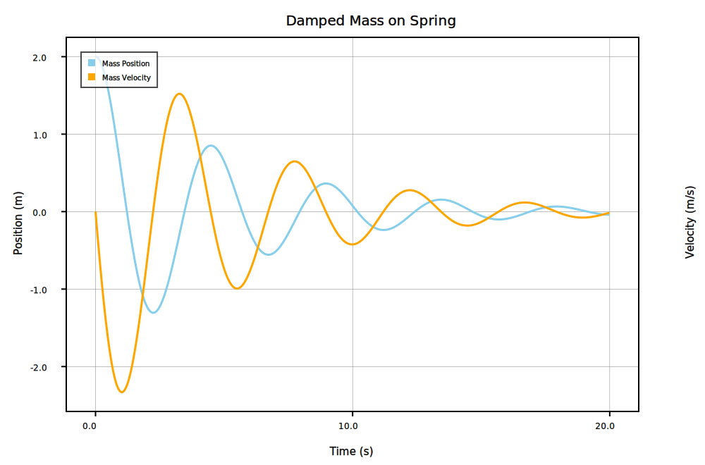

# SymbolLab

This is a sort of numerical modeling framework plus some other stuff. It started as two seperate personal projects, then they sorta merged. So, if there is some functionality that doesn't appear to be related to anything, then it's probably just left from when this was two different things.

## Getting Started

First off, at the moment, I only have a symbolic math backend written for [SymEngine](https://github.com/symengine/symengine), using the [SymEngine.swift](https://github.com/ianruh/SymEngine.swift) wrapper for it. So, first install SymEngine, following the directions in SymEngine.swift. 

**Damped Oscillator**

Next, we can start defining our system. First, we declare all of the variables we are going to need (I've declared the constants here as well using the `Decimal` type, but they could be put directly into the system as `-0.5` is further below).

```swift
let m: Decimal = 1.0          // Mass
let k: Decimal = 4.0          // Spring constant
let b: Decimal = 0.4          // Damping parameter
let ff = Variable("ff")                 // Damping force
let fs = Variable("fs")                 // Spring force
let x = Variable("x", initialValue: 2)  // Mass position
let v = Variable("v", initialValue: 0)  // Mass velocity
let t = Variable("t")                   // Time
```

The `Decimal` type is for decimal numbers (backed by doubles, not arbitrary precision). There is a coresponding type for integers (`Number`), though in most cases they will behave the same.

The `Variable` type declares each variable we are going to use in the system. For the `x` and `v` variables, we provide an initial values along with the name because they are the two depedent variables in the system below:

```swift
let system: System = [
    ff ≈ -1.0 * b*v,                                        // Damping force
    fs ≈ -0.5 * (k*x),                                      // Spring force
    Derivative(of: v, wrt: t) ≈ (fs + ff)/m,
    Derivative(of: x, wrt: t) ≈ v
]
```

[^1]: This definition of the system is more verbose than I would normally write it. However, the Swift compiler has a difficult time determining types when the expressions for the damping force and spring force are included directly in the ODE. The workaround for when it complains it can't determine types is just to break apart the expression as was done for the two forces above.

Here, we construct a simple system for a damped oscilator. Most of the operators (`+,-,*,/,**`) for basic math should 'Just Work' with all of the types in SymbolLab. In this system, we constructed an ODE using a `Derivative` object, but one could also construct an expression using an deirvative that can be immediately calculated (e.g. `Derivative(of: x**2, wrt: x)`, which would evaluate to `2*x`).

We also have to define the range over which we want to solve the ODE (look at the Notes section for some details about this):

```swift
var tVals = Array(stride(from: 0.0, through: 20.0, by: 0.01)) // Time values to use
```

Now, we can solve out system and plot it. For this example, and for the examples in `Sources/Examples/`, we use [SwiftPlot](https://github.com/KarthikRIyer/swiftplot) for plotting, though any other library should work.

```swift
do {
    // Solve the system and extract the position and velocity
    let (values, errors, iterations) = try system.solve(at: ["t": tVals], using: SymEngineBackend.self)
    var xVals = values.map({$0["x"]!})
    var vVals = values.map({$0["v"]!})

    //... Plotting Code ...//
    // Look at the examples for details
} catch {
    print(error)
}
```



## Notes

**ODE Solving**

The current method for solving ODEs is just forward euler, so it won't be very stable or accurate comparatively. I'm planning on implementing a solver framework to support general implicit and explicit methods.

**Symbolic Math Engine**

At the moment, the only symbolic math backend implemented is for SymEngine, however, it should be pretty simple to implement one that uses SymPy. Additionally, a pure swift on could be written without too much hassle to do basic operations.

**Supported Platforms**

This will only work on macOS at the moment. The only thing holding it back from Linux (and I think it would also work on Windows after) is that the Swift wrapper this is using for BLAS ([LASwift](https://github.com/AlexanderTar/LASwift)) uses the BLAS that is part of Apple's Accelerate framework explicitly, rather than a general BLAS implementation. Once that is generalized, it should be able to run on Linux and Windows.

## FAQ

**Should this be used for anything remotely important?**

Not if you value your job.

## ToDo

- Generalized ODE solving framework to support explicit and implicit methods.

- Actual constraint checking, and using this to solve independent subsystems individually rather than solve everything all at once.

- Componetized system construction. i.e.

  ```swift
  public protocol Component {}
  
  public struct Pump: Component {
      public var constraints: System {
          m_dot_in ≈ m_dot_out,
          h_dot_in ≈ h_dot_out,
          self.pressureRatio ≈ pressure_out / pressure_in,
          ...
      }
      
      public init(pr pressureRatio: Double) {}
  }
  
  
  
  let wholeSystem = Pump(pr: 2) -> Pump(pr: 5)
  ```

  This would make modeling of more complex physical systems much easier.

- Get LASwift to support generic BLAS implentations rather than just Accelerate.

- Add units to variables and numbers to check the dimensionality of equations.